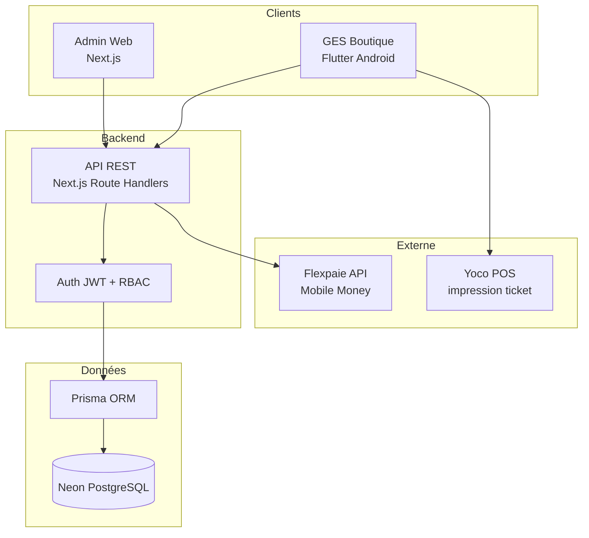
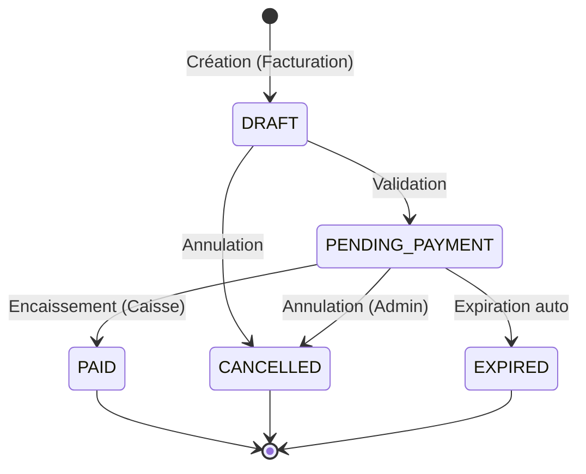
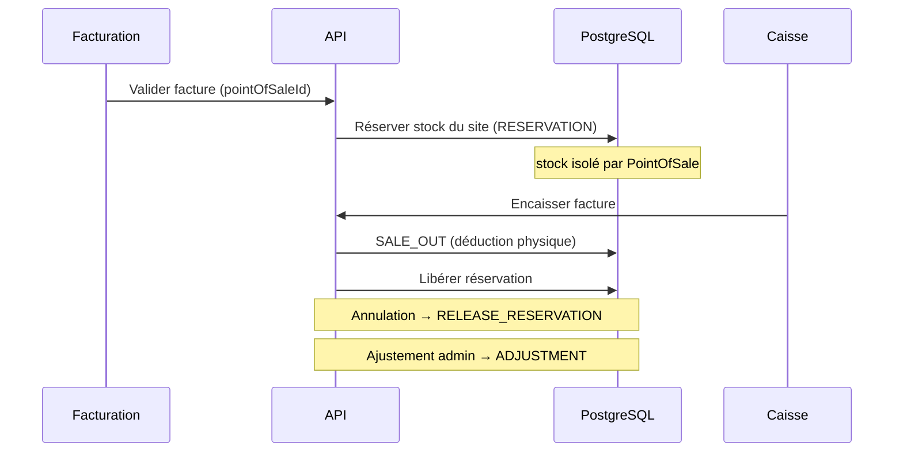
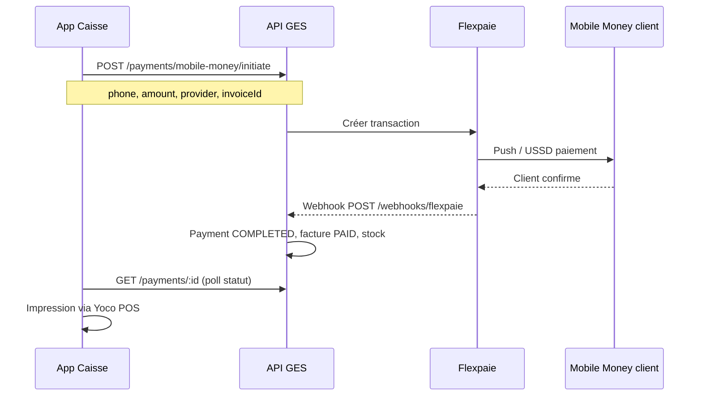
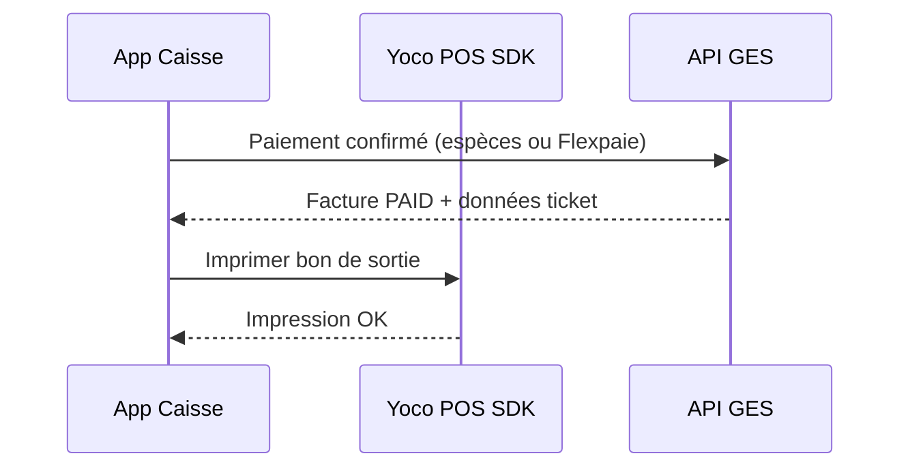

# Architecture — GES Boutique

## Vue d'ensemble



## Contexte RDC

| Paramètre | Valeur |
|-----------|--------|
| Pays | République Démocratique du Congo |
| Devise | **CDF** (Franc Congolais, montants entiers) |
| Multi-sites | Points de vente (`STORE`) + dépôts (`DEPOT`) avec stock isolé |
| Paiement Mobile Money | **API Flexpaie** (côté serveur) |
| Impression ticket | **Yoco POS** Android — impression uniquement |

Voir [DECISIONS.md](./DECISIONS.md) pour le détail des choix validés.

## Principes de conception

1. **API unique** — Les 2 applications consomment la même API REST hébergée dans `apps/admin`.
2. **Source de vérité centralisée** — Neon PostgreSQL via Prisma ; pas de stockage métier local persistant sur mobile (cache lecture seule uniquement).
3. **RBAC par rôle** — L'app mobile adapte les écrans selon le rôle (`FACTURANT`, `CAISSIER`, `ADMIN`, `MANAGER`).
4. **Facture comme pivot** — La facture relie inventaire, vente et encaissement, **rattachée à un point de vente**.
5. **Stock par site** — Chaque `PointOfSale` (magasin ou dépôt) gère son propre inventaire.
6. **Offline-first limité** — La facturation peut créer des brouillons hors-ligne ; la caisse exige une connexion pour paiement et stock.

---

## Applications

### 1. Admin (Web Dashboard)

**Utilisateurs** : Administrateurs, managers

**Modules** :

| Module | Fonctionnalités |
|--------|-----------------|
| Produits | CRUD, catégories, prix, codes-barres, TVA |
| Inventaire | Stock actuel, mouvements, alertes seuil, ajustements |
| Factures | Consultation, annulation, export |
| Rapports | CA journalier/mensuel, top produits, écarts caisse |
| Utilisateurs | Gestion comptes, rôles, points de vente |
| Points de vente | CRUD magasins & dépôts, assignation utilisateurs, config imprimante Yoco par site |
| Paramètres | Organisation, devise CDF, TVA, clés Flexpaie, transferts inter-dépôts |

**Stack** : Next.js 15 App Router, React, shadcn/ui, TanStack Query, Recharts

### 2. GES Boutique (Flutter — Android)

**Chemin** : `apps/caisse`

**Utilisateurs** : Vendeurs (`FACTURANT`), caissiers (`CAISSIER`), managers et admins

**Plateforme** : Android (Yoco POS pour impression)

**Modules selon le rôle** :

| Module | Rôles | Fonctionnalités |
|--------|-------|-----------------|
| Facturation | FACTURANT, ADMIN, MANAGER | Sélection POS, recherche produits, création/validation facture → `PENDING_PAYMENT`, réservation stock |
| Caisse | CAISSIER, ADMIN, MANAGER | Session caisse, recherche factures en attente, encaissement espèces / Mobile Money (Flexpaie), impression bon de sortie Yoco |

**Contraintes** :
- Encaissement réservé aux rôles caisse (session obligatoire pour `CAISSIER`)
- Connexion requise pour validation facture, paiement et stock

---

## Modèle de données (résumé)

```
ShopSettings (organisation, CDF, TVA)

PointOfSale ──┬── type: STORE | DEPOT
              ├── ProductStock (stock par site)
              ├── Invoice (STORE uniquement)
              └── CashSession (STORE uniquement)

User ──┬── Role (ADMIN | MANAGER | FACTURANT | CAISSIER)
       └── UserPointOfSale → PointOfSale(s) assigné(s)

Product ── Category
        └── ProductStock (par PointOfSale)

StockTransfer ── DEPOT → STORE (TRANSFER_OUT / TRANSFER_IN)

Invoice ── InvoiceLine ── Product
        ├── PointOfSale (obligatoire)
        ├── customerName? + customerPhone? (optionnels)
        ├── Payment(s)
        └── CashSession

CashSession ── User + PointOfSale
```

Voir le schéma complet : `packages/database/prisma/schema.prisma`

---

## Cycle de vie d'une facture



| Statut | Description | Stock |
|--------|-------------|-------|
| `DRAFT` | Brouillon en cours d'édition | Aucun impact |
| `PENDING_PAYMENT` | Validée, en attente caisse | Réservé |
| `PAID` | Encaissée | Déduit définitivement |
| `CANCELLED` | Annulée | Réservation libérée |
| `EXPIRED` | Non payée dans le délai | Réservation libérée |

---

## Gestion du stock



**Types de mouvements** : `SALE_OUT`, `RESERVATION`, `RELEASE_RESERVATION`, `ADJUSTMENT`, `PURCHASE_IN`, `RETURN`, `TRANSFER_OUT`, `TRANSFER_IN`

---

## Authentification & autorisation

- **JWT** (access token 15 min + refresh token 7 jours)
- **RBAC** par rôle et par endpoint

| Ressource | ADMIN | MANAGER | FACTURANT | CAISSIER |
|-----------|:-----:|:-------:|:---------:|:--------:|
| Produits (CRUD) | ✓ | lecture | lecture | — |
| Inventaire | ✓ | ✓ | lecture | — |
| Créer facture | ✓ | ✓ | ✓ | — |
| Encaisser | ✓ | ✓ | — | ✓ |
| Rapports | ✓ | ✓ | — | — |
| Utilisateurs | ✓ | — | — | — |
| Points de vente | ✓ | lecture | — | — |
| Transferts stock | ✓ | ✓ | — | — |
| Session caisse | ✓ | ✓ | — | ✓ |

---

## API

REST JSON sous `/api/v1/`. Authentification Bearer JWT.

Endpoints principaux :
- `POST /auth/login`
- `GET/POST /points-of-sale`, assignation utilisateurs
- `GET/POST /products`, `GET/PUT/DELETE /products/:id`
- `GET /inventory?pointOfSaleId=`, `POST /inventory/transfer`
- `GET/POST /invoices`, `GET/PATCH /invoices/:id`
- `POST /invoices/:id/validate`
- `POST /payments` (encaissement espèces)
- `POST /payments/mobile-money/initiate` (Flexpaie)
- `POST /webhooks/flexpaie` (callback Flexpaie)
- `GET/POST /cash-sessions`
- `GET /reports/*`

Détail complet : [API.md](./API.md)

---

## Intégration paiements (Caisse — Android RDC)

### Flexpaie — Mobile Money



- Initiation **côté serveur** (clés Flexpaie jamais exposées au mobile)
- Webhook Flexpaie pour confirmation asynchrone
- Idempotence via `flexpaieTransactionId` unique
- Statut `PENDING` jusqu'à confirmation webhook

### Yoco POS — Impression uniquement



- Yoco **ne traite aucun paiement** — impression ticket thermique seulement
- Config par point de vente : `yocoPrintEnabled`, `yocoDeviceId`
- Déclenché **après** confirmation paiement (espèces ou Flexpaie)
- Support paiement mixte : `CASH` + `MOBILE_MONEY` sur une même facture

---

## Déploiement cible

| Composant | Hébergement suggéré |
|-----------|---------------------|
| Admin + API | Vercel |
| Base de données | Neon (PostgreSQL serverless) |
| App Facturation | Play Store + App Store |
| App Caisse | Play Store (Android uniquement) |

---

## Phases de livraison

### Phase 1 — Fondations
- Schéma Prisma + migrations Neon
- API auth + produits + inventaire
- Admin : CRUD produits, vue stock

### Phase 2 — Facturation mobile
- API factures (CRUD, validation, réservation stock)
- Module facturation dans l'app Flutter GES Boutique
- Admin : consultation factures

### Phase 3 — Caisse mobile
- API paiements espèces + Flexpaie (initiate + webhook)
- Module caisse dans l'app Flutter GES Boutique
- Impression bon de sortie via Yoco POS

### Phase 4 — Rapports & finitions
- Dashboard rapports admin
- Alertes stock, exports
- Tests E2E, documentation opérateur
