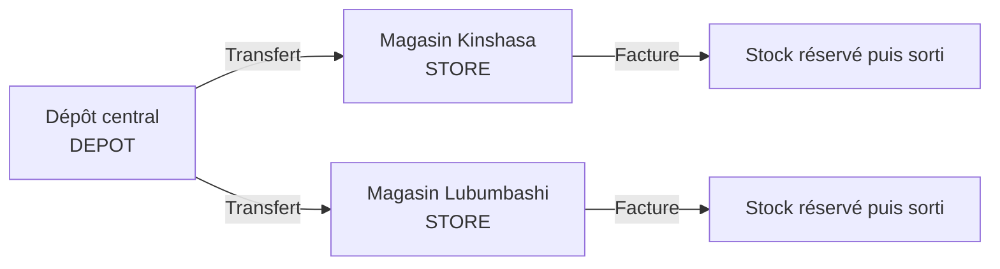
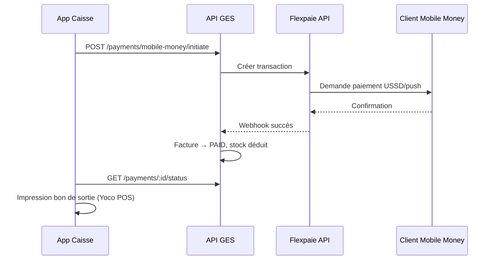

# Décisions produit — GES Boutique (RDC)

Document de référence des choix validés pour la conception.

## Contexte

| Paramètre | Valeur |
|-----------|--------|
| Pays | République Démocratique du Congo (RDC) |
| Devise | **CDF** (Franc Congolais) |
| Montants | Entiers en CDF (pas de centimes) |
| App Caisse | **Android uniquement** |

---

## Clients

Les informations client sur une facture sont **entièrement optionnelles** :

| Champ | Obligatoire | Description |
|-------|:-----------:|-------------|
| Nom | Non | `customerName` sur la facture |
| Téléphone | Non | `customerPhone` sur la facture |

- Pas d'email ni d'adresse client requis.
- Si renseignés, le client peut être enregistré pour recherche ultérieure (historique par téléphone).
- Une facture peut être validée sans aucune info client.
- Pour Mobile Money (Flexpaie), le numéro de téléphone peut être saisi au moment du paiement.

---

## Multi-points de vente

Le système gère **plusieurs points de vente et dépôts**, chacun avec son propre stock.

### Types de site

| Type | Code enum | Rôle |
|------|-----------|------|
| **Point de vente** | `STORE` | Facturation, caisse, stock local |
| **Dépôt** | `DEPOT` | Stock uniquement, réapprovisionnement des magasins |

### Règles

1. **Stock isolé par site** — `ProductStock` est unique par couple `(productId, pointOfSaleId)`.
2. **Facture rattachée à un STORE** — la validation réserve le stock du point de vente émetteur.
3. **Caisse par STORE** — session caisse ouverte sur un point de vente précis.
4. **Numérotation factures par site** — ex. `KIN-FAC-0042`, `LUB-FAC-0015`.
5. **Utilisateurs assignés** — un facturant/caissier est rattaché à un ou plusieurs sites via `UserPointOfSale`.
6. **Transferts inter-sites** — dépôt → magasin via `StockTransfer` (`TRANSFER_OUT` / `TRANSFER_IN`).

### Admin multi-sites

- **ADMIN** : accès à tous les sites.
- **MANAGER** : sites assignés uniquement.
- **FACTURANT / CAISSIER** : opèrent sur le(s) site(s) assigné(s) ; sélection du site actif au login mobile.

---

## Paiements & intégrations

### Séparation des rôles

| Intégration | Rôle | Usage |
|-------------|------|-------|
| **Yoco POS** | **Impression uniquement** | Bon de sortie / ticket thermique via terminal POS Android |
| **Flexpaie API** | **Paiement Mobile Money** | Orange Money, Airtel Money, M-Pesa, etc. |
| **Espèces** | Paiement manuel | Saisie caissier, calcul du rendu |

> **Important** : Yoco n'est **pas** utilisé pour encaisser. Il sert uniquement à imprimer le bon de sortie après confirmation du paiement.

### Yoco (impression — Android)

| Paramètre | Valeur |
|-----------|--------|
| Plateforme | Android uniquement |
| SDK | Yoco POS SDK — **impression ticket uniquement** |
| Configuration | Par point de vente (`yocoPrintEnabled`, `yocoDeviceId`) |
| Déclenchement | Après paiement confirmé (espèces ou Flexpaie) |

### Flexpaie (Mobile Money)

| Paramètre | Valeur |
|-----------|--------|
| Type | API REST côté serveur (Next.js) |
| Configuration | Organisation (`flexpaieApiKey`, `flexpaieMerchantId`) |
| Flux | Initiation API → confirmation client (USSD/push) → webhook Flexpaie → facture PAID |
| Référence | `flexpaieTransactionId` + `flexpaieReference` stockés sur `Payment` |
| Statut | `PENDING` → `COMPLETED` ou `FAILED` |

### Modes de paiement supportés (v1)

- `CASH` — espèces (saisie manuelle caissier)
- `MOBILE_MONEY` — via **API Flexpaie** (Orange, Airtel, etc.)
- Paiement **mixte** : espèces + Mobile Money sur une même facture

---

## TVA

- Taux par défaut : **16 %** (configurable dans `ShopSettings.defaultTaxRate`).
- Taux surchargeable par produit (`Product.taxRate`).
- Affichage HT / TVA / TTC sur factures et bons de sortie.

---

## Hors périmètre v1

- App Caisse iOS
- Paiement carte bancaire via Yoco (Yoco = impression seule)
- Sync offline caisse
- Multi-devises
- Fidélité client avancée
